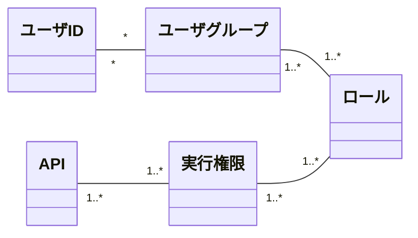

# Belayer Web API 認可制御

## 前提事項

* ユーザ認証については、tsubarkuroを経由して認証サーバ(harinoki)にアクセスし、認証およびトークンの取得を行う。
* トークンには認可情報をもたないため、認可情報はBelayer内で持つこととする。

## 認可モデル

* Belayerに含まれるAPIは、それぞれ必ず要求する実行権限を固定で1つ以上持つ
    * ユーザが持つロールに紐づく実行権限のうち、１つでも要求する実行権限にマッチすればAPIを実行可能
* Belayerは実行権限とロールのマッピングを持つ
    * 1つのロールは複数の権限を持つことができる
    * マッピングに存在しない実行権限はデフォルトのロールに属する
* 該当ロールを持つユーザを正規表現で指定する（これをユーザグループとする）

### 概念モデル



### 実行権限

#### 実行権限の一覧

|実行権限|説明|
|:----|:----|
|P_FILE_LIST|サーバ上のストレージ領域のファイル・ディレクトリの一覧取得が可能|
|P_UPLOAD|サーバ上のストレージ領域へのファイルアップロードが可能|
|P_DOWNLOAD|サーバ上のストレージ領域のファイルダウンロードが可能|
|P_FILE_DIR_DELETE|サーバ上のストレージ領域のファイル・ディレクトリの削除が可能|
|P_BACKUP|バックアップの実行が可能|
|P_RESTORE|リストアの実行が可能|
|P_DUMP|ダンプファイルの取得が可能|
|P_LOAD|ダンプファイルのロードが可能|
|P_STREAM_API|Stream APIを利用した同一トランザクション内のダンプ・ロードが可能|
|P_SESSION_CTL|セッションの参照やセッションの強制アボートが可能|
|P_DB_START|DBの起動が可能|
|P_DB_STOP|DBの停止が可能|
|P_DB_STATUS|DBの起動状態の取得が可能|
|P_TABLE_LIST|DBのテーブル一覧の取得が可能|
|P_ROLE_EDIT|ロールとユーザのマッピング情報の参照・更新が可能|


#### 実行権限とAPIの対応

|実行権限|使用可能なAPI|備考|
|:----|:----|:----|
|なし|ユーザ認証API|未認証のユーザも実行可能|
|なし|トークンリフレッシュAPI|未認証のユーザも実行可能|
|P_UPLOAD|ファイルアップロードAPI| |
|P_DOWNLOAD|ファイルダウンロードAPI| |
|P_DOWNLOAD|ファイル一括ダウンロードAPI| |
|P_FILE_DIR_DELETE|ファイル削除API| |
|P_FILE_DIR_DELETE|ファイル複数削除API| |
|P_FILE_DIR_DELETE|ディレクトリ削除API| |
|P_FILE_LIST|ディレクトリ一覧取得API| |
|P_BACKUP|バックアップ実行指示API| |
|P_RESTORE|データリストア実行指示API| |
|P_BACKUP, P_RESTORE|バックアップ／リストア一覧取得API|いずれかを持てば実行可能|
|P_BACKUP, P_RESTORE|バックアップ／リストア実行ステータス取得API|いずれかを持てば実行可能|
|P_BACKUP, P_RESTORE|バックアップ／リストアキャンセルAPI|いずれかを持てば実行可能|
|P_DUMP|ダンプ取得API| |
|P_LOAD|データロードAPI| |
|P_DUMP, P_LOAD|ダンプ／ロード一覧取得API|いずれかを持てば実行可能|
|P_DUMP, P_LOAD|ダンプ／ロード実行ステータス取得API|いずれかを持てば実行可能|
|P_DUMP, P_LOAD|ダンプ／ロードキャンセルAPI|いずれかを持てば実行可能|
|P_STREAM|トランザクション開始API| |
|P_STREAM|トランザクションコミット/ロールバックAPI| |
|P_STREAM|トランザクション確認API| |
|P_STREAM|ストリームデータダンプAPI| |
|P_STREAM|ストリームデータロードAPI| |
|P_SESSION_CTL|セッションステータス確認API| |
|P_SESSION_CTL|セッション変数設定API| |
|P_SESSION_CTL|セッション停止API| |
|P_DB_START|DB起動API| |
|P_DB_STOP|DB停止API| |
|P_DB_STATUS|DBステータス確認API| |
|P_TABLE_LIST|テーブル名一覧取得API| |
|P_ROLE_EDIT|ロール定義取得API| |
|P_ROLE_EDIT|ロール・ユーザマッピング取得API| |
|P_ROLE_EDIT|ロール・ユーザマッピング更新API| |

### 実行権限を持つロールの定義例

* 実行権限毎に、その実行権限をもつロールを指定する（複数指定可能）
    * すべての実行権限は何かしらのロールに紐づけられなければならない。
        * 特定のロールが割り当てられていない実行権限は、<u>誰も実行できない機能</u>と扱われる。
    * **ロールが実行権限があった場合、Belayerサーバの起動時にWARNログを出力する。**
* このマッピングはBelayer内部に設定ファイルとしてもつ
    * src/main/resources/config/permission.properties

    ```text
    permission.defaultRole=ROLE_USER
    permission.config.P_FILE_LIST=ROLE_ADMIN,ROLE_BACKUP,ROLE_RESTORE,ROLE_DUMP,ROLE_LOAD,ROLE_USER
    permission.config.P_UPLOAD=ROLE_ADMIN,ROLE_RESTORE,ROLE_LOAD
    permission.config.P_DOWNLOAD=ROLE_ADMIN,ROLE_BACKUP,ROLE_RESTORE,ROLE_DUMP,ROLE_LOAD
    permission.config.P_FILE_DIR_DELETE=ROLE_ADMIN,ROLE_BACKUP,ROLE_RESTORE,ROLE_DUMP,ROLE_LOAD
    permission.config.P_BACKUP=ROLE_ADMIN,ROLE_BACKUP
    permission.config.P_RESTORE=ROLE_ADMIN,ROLE_RESTORE
    permission.config.P_DUMP=ROLE_ADMIN,ROLE_DUMP
    permission.config.P_LOAD=ROLE_ADMIN,ROLE_LOAD
    permission.config.P_STREAM_API=ROLE_ADMIN,ROLE_STREAM_API
    permission.config.P_SESSION_CTL=ROLE_ADMIN,ROLE_SESSION_CTL
    permission.config.P_DB_START=ROLE_ADMIN,ROLE_RESTORE,ROLE_DB_UP
    permission.config.P_DB_STOP=ROLE_ADMIN,ROLE_RESTORE,ROLE_DB_DOWN
    permission.config.P_DB_STATUS=ROLE_ADMIN,ROLE_USER
    permission.config.P_TABLE_LIST=ROLE_ADMIN,ROLE_DUMP,ROLE_LOAD
    permission.config.P_ROLE_EDIT=ROLE_ADMIN
    ```
    
    * 上記のマッピングの内容は以下のとおり
        * 補足事項
            * リストアのためにはDBの停止と起動が必要なため、DBの起動と停止の権限を一緒に付与する。
            * ROLE_DB_UPロールは、Admin以外にDB起動を許すためのロールである。
            * ROLE_DB_DOWNロールは、Admin以外にDB停止を許すためのロールである。

|                   | ROLE_ADMIN | ROLE_BACKUP | ROLE_RESTORE | ROLE_DUMP | ROLE_LOAD | ROLE_STREAM_API | ROLE_DB_UP | ROLE_DB_DOWN | ROLE_SESSION_CTL | ROLE_USER<br/>(all authenticated user) |
|-------------------|:----------:|:-----------:|:------------:|:---------:|:---------:|:---------------:|:----------:|:----------:|:----------------:|:---------:|
| P_FILE_LIST       |      ○     |      ○      |      ○       |     ○     |     ○     |        ー       |     ー     |     ー     |        ー        |     ○     |
| P_UPLOAD          |      ○     |      ー     |       ○      |     ー    |     ○     |        ー       |     ー     |     ー     |        ー        |     ー    |
| P_DOWNLOAD        |      ○     |      ○      |       ○      |     ○     |     ○     |        ー       |     ー     |     ー     |        ー        |     ー    |
| P_FILE_DIR_DELETE |      ○     |      ○      |       ○      |     ○     |     ○     |        ー       |     ー     |     ー     |        ー        |     ー    |
| P_BACKUP          |      ○     |      ○      |      ー      |     ー    |     ー    |        ー       |     ー     |     ー     |        ー        |     ー    |
| P_RESTORE         |      ○     |      ー     |       ○      |     ー    |     ー    |        ー       |     ー     |     ー     |        ー        |     ー    |
| P_DUMP            |      ○     |      ー     |      ー      |     ○     |     ー    |        ー       |     ー     |     ー     |        ー        |     ー    |
| P_LOAD            |      ○     |      ー     |      ー      |     ー    |     ○     |        ー       |     ー     |     ー     |        ー        |     ー    |
| P_STREAM_API      |      ○     |      ー     |      ー      |     ー    |     ー    |        ○        |     ー     |     ー     |        ー        |     ー    |
| P_SESSION_CTL     |      ○     |      ー     |      ー      |     ー    |     ー    |        ー       |     ー     |     ー     |         ○        |     ー    |
| P_DB_START        |      ○     |      ー     |       ○      |     ー    |     ー    |        ー       |      ○     |     ー     |        ー        |     ー    |
| P_DB_STOP         |      ○     |      ー     |       ○      |     ー    |     ー    |        ー       |     ー     |     ○     |        ー        |     ー    |
| P_DB_STATUS       |      ○     |      ー     |      ー      |     ー    |     ー    |        ー       |     ー     |     ー     |        ー        |     ○     |
| P_TABLE_LIST      |      ○     |      ー     |      ー      |     ○     |     ○     |        ー       |     ー     |     ー     |        ー        |     ー    |
| P_ROLE_EDIT       |      ○     |      ー     |      ー      |     ー    |     ー    |        ー       |     ー     |     ー     |        ー        |     ー    |


### ロールを持つユーザの指定例

* 指定したロールを持つユーザIDを正規表現で指定することが可能
* マッピングのデフォルト値はWebAPIサーバ起動時の環境変数で**JSON文字列**を指定することが可能
    * export BELAYER_DEFAULT_ROLE_USER_MAPPING='{"ROLE_ADMIN": ["tsurugi"], "ROLE_BACKUP": ["backup_.*"],"ROLE_STREAM_API": ["stream_.*"]}'
* ロール・ユーザマッピング取得APIとロール・ユーザマッピング更新APIを使用して、ユーザ・ロールマッピング情報を編集することが可能
    * Note: 更新した情報は`${BELAYER_STORAGE_ROOT}/belayer_role_users.json`に保存される。
        * **サーバ再起動時はこのファイルが参照されるため、以降は`BELAYER_DEFAULT_ROLE_USER_MAPPING`環境変数は参照されないことに注意が必要である。**
    * APIによるロール・ユーザマッピング定義の参照と更新方法は以下の通り。

    ```
    # 認証トークンの取得
    $ TOKEN=`curl -s -d uid=tsurugi -d pw=password localhost:8000/api/auth | jq -r ".accessToken"`
    # 設定可能なロール一覧を表示する
    $ curl -s -H "Authorization:Bearer $TOKEN" localhost:8000/api/list/roles
    {
      "ROLE_DB_DOWN" : [ "P_DB_STOP" ],
      "ROLE_STREAM_API" : [ "P_STREAM_API" ],
      "ROLE_LOAD" : [ "P_TABLE_LIST", "P_UPLOAD", "P_LOAD", "P_FILE_DIR_DELETE", "P_FILE_LIST", "P_DOWNLOAD" ],
      "ROLE_DB_UP" : [ "P_DB_START" ],
      "ROLE_USER" : [ "P_DB_STATUS", "P_FILE_LIST" ],
      "ROLE_DUMP" : [ "P_TABLE_LIST", "P_FILE_DIR_DELETE", "P_FILE_LIST", "P_DUMP", "P_DOWNLOAD" ],
      "ROLE_SESSION_CTL" : [ "P_SESSION_CTL" ],
      "ROLE_RESTORE" : [ "P_UPLOAD", "P_RESTORE", "P_FILE_DIR_DELETE", "P_DB_START", "P_FILE_LIST", "P_DOWNLOAD", "P_DB_STOP" ],
      "ROLE_ADMIN" : [ "P_DB_STATUS", "P_TABLE_LIST", "P_STREAM_API", "P_DB_START", "P_FILE_LIST", "P_SESSION_CTL", "P_DOWNLOAD", "P_DB_STOP", "P_BACKUP", "P_ROLE_EDIT", "P_UPLOAD", "P_RESTORE", "P_LOAD", "P_FILE_DIR_DELETE", "P_DUMP" ],
      "ROLE_BACKUP" : [ "P_BACKUP", "P_FILE_DIR_DELETE", "P_FILE_LIST", "P_DOWNLOAD" ]
    }
    # 現状のロール・ユーザマッピング定義を確認する
    $ curl -s -H "Authorization:Bearer $TOKEN" localhost:8000/api/show/roleuser
    {
      "ROLE_ADMIN": ["admin","admin_.*", "tsurugi"],
      "ROLE_STREAM_API": ["stream_.*"],
      "ROLE_BACKUP": ["backup_.*"],
      "ROLE_LOAD": ["foo", "bar"]
    }
    # 現状のロール・ユーザマッピング定義をファイルにダンプする
    $ curl -s -H "Authorization:Bearer $TOKEN" "localhost:8000/api/show/roleuser"  | jq "." > role.json
    # ロール・ユーザマッピング定義ファイルを編集する
    $ vi role.json
    <edit role.json>
    # ロール・ユーザマッピング定義ファイルをBelyaer Serverに適用する
    $ curl -v -H "Authorization:Bearer $TOKEN" "localhost:8000/api/update/roleuser" -d @role.json
    Success
    $
    ```
