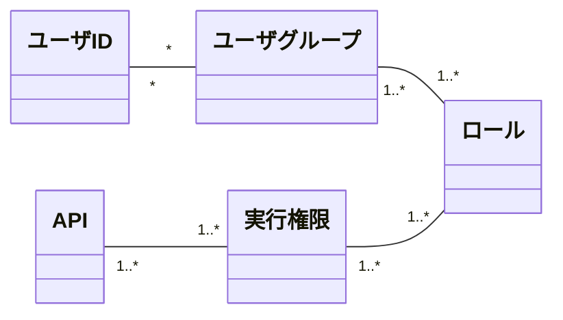

# Belayer Web API 認可制御

## 認可モデル

* Belayerに含まれるAPIは、それぞれ必ず要求する実行権限を固定で1つ以上持つ
    * ユーザが持つロールに紐づく実行権限のうち、１つでも要求する実行権限にマッチすればAPIを実行可能
* Belayerは実行権限とロールのマッピングを持つ
    * 1つのロールは複数の権限を持つことができる
    * マッピングに存在しない実行権限はデフォルトのロールに属する
* 該当ロールを持つユーザを正規表現で指定する（これをユーザグループとする）

### 概念モデル



### 実行権限

#### 実行権限の一覧

|実行権限|説明|
|:----|:----|
|P_FILE_LIST|サーバ上のストレージ領域のファイル・ディレクトリの一覧取得が可能|
|P_UPLOAD|サーバ上のストレージ領域へのファイルアップロードが可能|
|P_DOWNLOAD|サーバ上のストレージ領域のファイルダウンロードが可能|
|P_FILE_DIR_DELETE|サーバ上のストレージ領域のファイル・ディレクトリの削除が可能|
|P_BACKUP|バックアップの実行が可能|
|P_RESTORE|リストアの実行が可能|
|P_DUMP|ダンプファイルの取得が可能|
|P_LOAD|ダンプファイルのロードが可能|
|P_STREAM_API|Stream APIを利用した同一トランザクション内のダンプ・ロードが可能|
|P_SESSION_CTL|セッションの参照やセッションの強制アボートが可能|
|P_DB_START|DBの起動が可能|
|P_DB_STOP|DBの停止が可能|
|P_DB_STATUS|DBの起動状態の取得が可能|
|P_TABLE_LIST|DBのテーブル一覧の取得が可能|


#### 実行権限とAPIの対応

|実行権限|使用可能なAPI|備考|
|:----|:----|:----|
|なし|ユーザ認証API|未認証のユーザも実行可能|
|なし|トークンリフレッシュAPI|未認証のユーザも実行可能|
|P_UPLOAD|ファイルアップロードAPI| |
|P_DOWNLOAD|ファイルダウンロードAPI| |
|P_DOWNLOAD|ファイル一括ダウンロードAPI| |
|P_FILE_DIR_DELETE|ファイル削除API| |
|P_FILE_DIR_DELETE|ファイル複数削除API| |
|P_FILE_DIR_DELETE|ディレクトリ削除API| |
|P_FILE_LIST|ディレクトリ一覧取得API| |
|P_BACKUP|バックアップ実行指示API| |
|P_RESTORE|データリストア実行指示API| |
|P_BACKUP, P_RESTORE|バックアップ／リストア一覧取得API|いずれかを持てば実行可能|
|P_BACKUP, P_RESTORE|バックアップ／リストア実行ステータス取得API|いずれかを持てば実行可能|
|P_BACKUP, P_RESTORE|バックアップ／リストアキャンセルAPI|いずれかを持てば実行可能|
|P_DUMP|ダンプ取得API| |
|P_LOAD|データロードAPI| |
|P_DUMP, P_LOAD|ダンプ／ロード一覧取得API|いずれかを持てば実行可能|
|P_DUMP, P_LOAD|ダンプ／ロード実行ステータス取得API|いずれかを持てば実行可能|
|P_DUMP, P_LOAD|ダンプ／ロードキャンセルAPI|いずれかを持てば実行可能|
|P_STREAM|トランザクション開始API| |
|P_STREAM|トランザクションコミット/ロールバックAPI| |
|P_STREAM|トランザクション確認API| |
|P_STREAM|ストリームデータダンプAPI| |
|P_STREAM|ストリームデータロードAPI| |
|P_SESSION_CTL|セッションステータス確認API| |
|P_SESSION_CTL|セッション変数設定API| |
|P_SESSION_CTL|セッション停止API| |
|P_DB_START|DB起動API| |
|P_DB_STOP|DB停止API| |
|P_DB_STATUS|DBステータス確認API| |
|P_TABLE_LIST|テーブル名一覧取得API| |

### 実行権限を持つロールの定義例

* 実行権限毎に、その実行権限をもつロールを指定する（複数指定可能）
* ロールが指定されていない実行権限はデフォルトのロールと紐づけられる
    * すべての認証済みユーザはデフォルトのロールを持つ
* このマッピングはBelayer内部に設定ファイルとしてもつ
* 以下の例では、次のように実行権限とロールの関係を指定している

    ```text
    permission.defaultRole=ROLE_USER
    permission.config.P_FILE_LIST=ROLE_ADMIN,USER
    permission.config.P_UPLOAD=ROLE_ADMIN,ROLE_RESTORE,ROLE_LOAD
    permission.config.P_DOWNLOAD=ROLE_ADMIN,ROLE_DUMP,ROLE_BACKUP
    permission.config.P_FILE_DIR_DELETE=ROLE_ADMIN,ROLE_BACKUP,ROLE_RESTORE,ROLE_DUMP,ROLE_LOAD
    permission.config.P_BACKUP=ROLE_ADMIN,ROLE_BACKUP
    permission.config.P_RESTORE=ROLE_ADMIN,ROLE_RESTORE
    permission.config.P_DUMP=ROLE_ADMIN,ROLE_DUMP
    permission.config.P_LOAD=ROLE_ADMIN,ROLE_LOAD
    permission.config.P_STREAM_API=ROLE_ADMIN,ROLE_STREAM_API
    permission.config.P_SESSION_CTL=ROLE_ADMIN,ROLE_SESSION_CTL
    permission.config.P_DB_START=ROLE_ADMIN,ROLE_RESTORE
    permission.config.P_DB_STOP=ROLE_ADMIN,ROLE_RESTORE
    permission.config.P_DB_STATUS=ROLE_ADMIN,ROLE_USER
    permission.config.P_TABLE_LIST=ROLE_ADMIN,ROLE_DUMP,ROLE_LOAD
    ```

    * ROLE_ADMINロールはすべての機能を実行可能
    * P_BACKUP実行権限はROLE_BACKUPロールを持つユーザに付与される
    * P_LOAD実行権限はROLE_EDITロールを持つユーザに付与される
    * P_STREAM_API実行権限はROLE_STREAM_APIロールを持つユーザに付与される
    * **ここに表記していない実行権限があった場合、Belayerサーバの起動時にWARNログを出力する。**
        * 特定のロールが割り当てられていない実行権限は、<u>誰も実行できない機能</u>と扱われる。

### ロールを持つユーザの指定例

* 指定したロールを持つユーザIDを正規表現で指定することが可能
* このマッピングはWebAPIサーバ起動時の環境変数で指定することが可能

    ```text
    {
      'ROLE_ADMIN':{'admin','admin_.*', 'tsurugi'},
      'ROLE_STREAM_API':{'stream_.*'},
      'ROLE_BACKUP': {'backup_.*'},
      'ROLE_LOAD':{'foo', 'bar'}
    }
    ```

    * この表現はSpringFrameworkにおいて`Map<String>, Set<String>>`をEL式で表記する方法である

## 【Appendix】 Belayer Web管理画面(Enterprise版)での導線制御の方法

* Belayer Web管理画面では、ユーザが該当機能を使用するための実行権限を持つかどうかによって、導線（画面表示やボタン押下の可否）を制御する
    * ロールによる制御ロジックを持つとサーバサイドとクライアントサイドで制御ロジックを二重に実装することになるため、それを避ける
* 上記を実現するため、ユーザ認証APIにて以下を実現する
    * ユーザ認証成功時に、ユーザIDからロールとロールが持つ実行権限を追跡し、ユーザが持つ『実行権限の集合』をユーザ認証APIのレスポンスで返す
* Web管理画面では以下のようにして、導線を制御する
    * ログイン時にユーザが持つ実行権限をキャッシュし、それ以降は、実行権限を持つ部分のみ提供するように導線を制御する