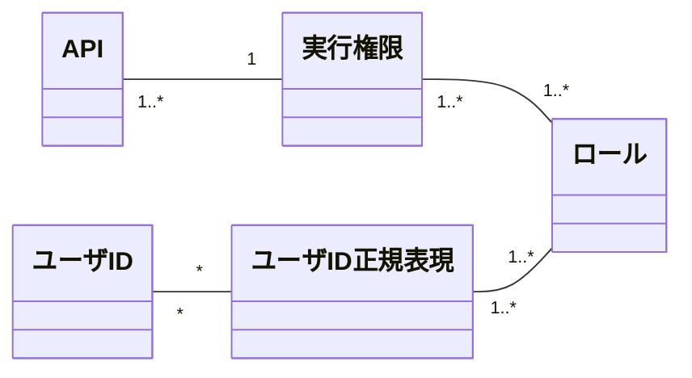

# Belayer Web API 認可制御

## 認可モデル

* Belayrに含まれるAPIは、それぞれ必ず要求する実行権限を固定で1つ持つ
    * ユーザが持つロールに紐づく実行権限のうち、１つでも要求する実行権限にマッチすればAPIを実行可能
* Belayerは実行権限とロールのマッピングを持つ
    * 1つのロールは複数の権限を持つことができる
    * マッピングに存在しない実行権限はデフォルトのロールに属する
* 該当ロールを持つユーザを正規表現で指定する（ユーザ正規表現）

### 概念モデル



### APIと実行権限の関係

| API                                         | 必要とする実行権限    | 備考         |
|---------------------------------------------|---------------------|--------------|
| ユーザ認証API                               | NONE                | 未認証のユーザも実行可能 |
| トークンリフレッシュAPI                     | NONE                | 未認証のユーザも実行可能 |
| ファイルアップロードAPI                     | P_FILE_CTL          |              |
| ファイルダウンロードAPI                     | P_FILE_CTL          |              |
| ファイル一括ダウンロードAPI                 | P_FILE_CTL          |              |
| ファイル削除API                             | P_FILE_CTL          |              |
| ファイル複数削除API                         | P_FILE_CTL          |              |
| ディレクトリ削除API                         | P_FILE_CTL          |              |
| ディレクトリ一覧取得API                     | P_FILE_CTL          |              |
| バックアップ実行指示API                     | P_BACKUP            |              |
| データリストア実行指示API                   | P_RESTORE           |              |
| バックアップ／リストア一覧取得API           | P_BACKUP, P_RESTORE | いずれかを持てば実行可能 |
| バックアップ／リストア実行ステータス取得API | P_BACKUP, P_RESTORE | いずれかを持てば実行可能 |
| バックアップ／リストアキャンセルAPI         | P_BACKUP, P_RESTORE | いずれかを持てば実行可能 |
| ダンプ取得API                               | P_DUMP              |              |
| データロードAPI                             | P_LOAD              |              |
| ダンプ／ロード一覧取得API                   | P_DUMP, P_LOAD      | いずれかを持てば実行可能 |
| ダンプ／ロード実行ステータス取得API         | P_DUMP, P_LOAD      | いずれかを持てば実行可能 |
| ダンプ／ロードキャンセルAPI                 | P_DUMP, P_LOAD      | いずれかを持てば実行可能 |
| トランザクション開始API                     | P_STREAM            |              |
| トランザクションコミット/ロールバックAPI    | P_STREAM            |              |
| トランザクション確認API                     | P_STREAM            |              |
| ストリームデータダンプAPI                   | P_STREAM            |              |
| ストリームデータロードAPI                   | P_STREAM            |              |
| セッションステータス確認API                 | P_SESSION_CTL       |              |
| セッション変数設定API                       | P_SESSION_CTL       |              |
| セッション停止API                           | P_SESSION_CTL       |              |
| DB起動API                                   | P_DB_CTL            |              |
| DB停止API                                   | P_DB_CTL            |              |
| DBステータス確認API                         | P_DB_STATUS         |              |
| テーブル名一覧取得API                       | P_DB_STATUS         |              |

### 実行権限を持つロールの定義例

* 実行権限毎に、その実行権限をもつロールを指定する（複数指定可能）
* ロールが指定されていない実行権限はデフォルトのロールと紐づけられる
    * すべての認証済みユーザはデフォルトのロールを持つ
* このマッピングはWebAPIサーバ起動時の環境変数で上書き定義することが可能
    * <u>基本的にBelayer導入ユーザがこのマッピング定義を変更することは想定していない</u>が、変更の弾力性を持たせるために外部設定化している
    * **注）環境変数で変更できないようにすることも可能**
* 以下の例では、次のように実行権限とロールの関係を指定している
    * この表現はSpringFrameworkにおいて`Map<String>, Set<String>>`をEL式で表記する方法である

    ```text
    {
      'P_DB_CTL': {'ROLE_ADMIN'},
      'P_SESSION_CTL': {'ROLE_ADMIN'},
      'P_RESTORE': {'ROLE_ADMIN'},
      'P_BACKUP': {'ROLE_ADMIN','ROLE_BACKUP'},
      'P_LOAD': {'ROLE_ADMIN','ROLE_EDIT'},
      'P_STREAM_API': {'ROLE_ADMIN','ROLE_STREAM_API'}
    }
    ```

    * ROLE_ADMINロールはすべての機能を実行可能
    * P_BACKUP実行権限はROLE_BACKUPロールを持つユーザに付与される
    * P_LOAD実行権限はROLE_EDITロールを持つユーザに付与される
    * P_STREAM_API実行権限はROLE_STREAM_APIロールを持つユーザに付与される
    * ここに表記していない実行権限はデフォルトロールに付与される。
        * これにより特定のロールに割り当てられていない実行権限は、すべての認証済みユーザに付与される。

### ロールを持つユーザの指定例

* 指定したロールを持つユーザIDを正規表現で指定することが可能
* このマッピングはWebAPIサーバ起動時の環境変数で指定することが可能

    ```text
    {
      'ROLE_ADMIN':{'admin','admin_.*', 'tsurugi'},
      'ROLE_STREAM_API':{'stream_.*'},
      'ROLE_BACKUP': {'backup_.*'},
      'ROLE_EDIT':{'foo', 'bar'}
    }
    ```

    * この表現はSpringFrameworkにおいて`Map<String>, Set<String>>`をEL式で表記する方法である

## 【Appendix】 Belayer Web管理画面(Enterprise版)での導線制御の方法

* Belayer Web管理画面では、ユーザが該当機能を使用するための実行権限を持つかどうかによって、導線（画面表示やボタン押下の可否）を制御する
    * ロールによる制御ロジックを持つとサーバサイドとクライアントサイドで制御ロジックを二重に実装することになるため、それを避ける
* 上記を実現するため、ユーザ認証APIにて以下を実現する
    * ユーザ認証成功時に、ユーザIDからロールとロールが持つ実行権限を追跡し、ユーザが持つユーザ権限の集合をユーザ認証APIのレスポンスで返す
* Web管理画面では以下のようにして、導線を制御する
    * ログイン時にユーザが持つ実行権限をキャッシュし、それ以降は、実行権限を持つ部分のみ提供するように導線を制御する